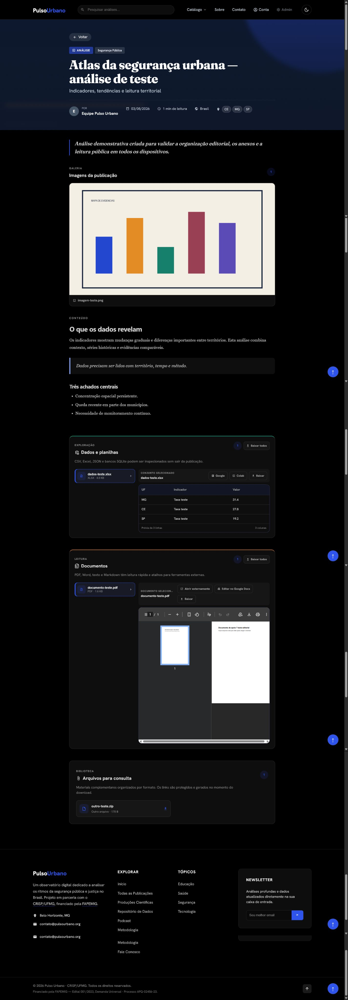
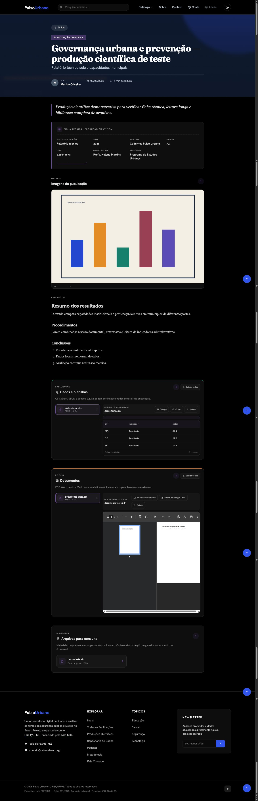
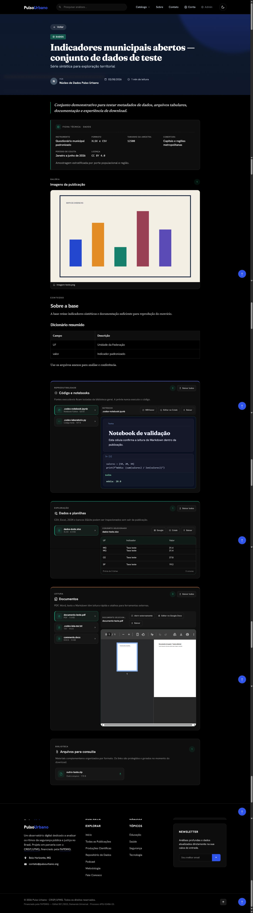
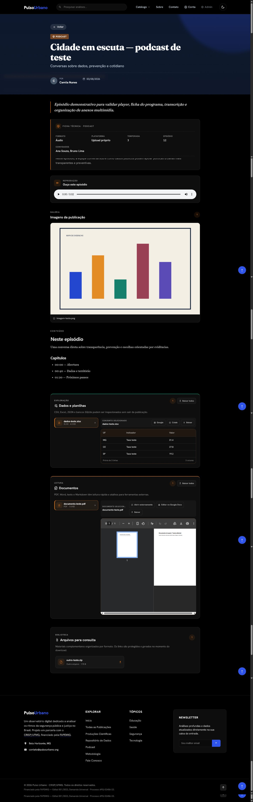
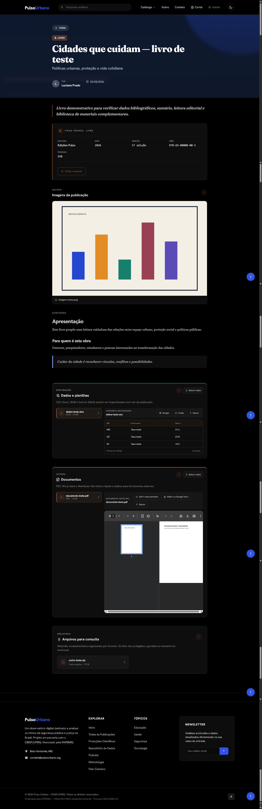
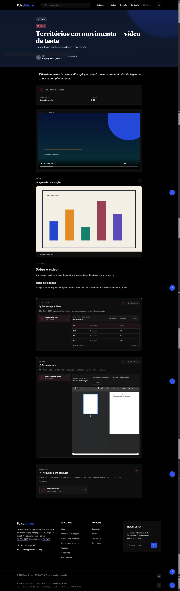
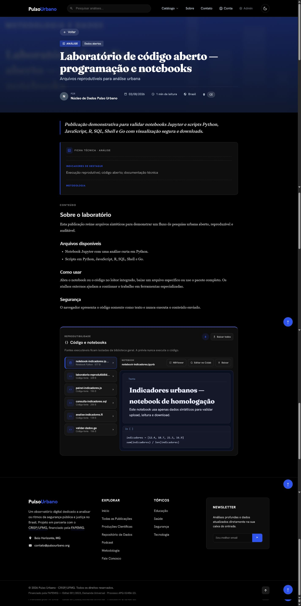
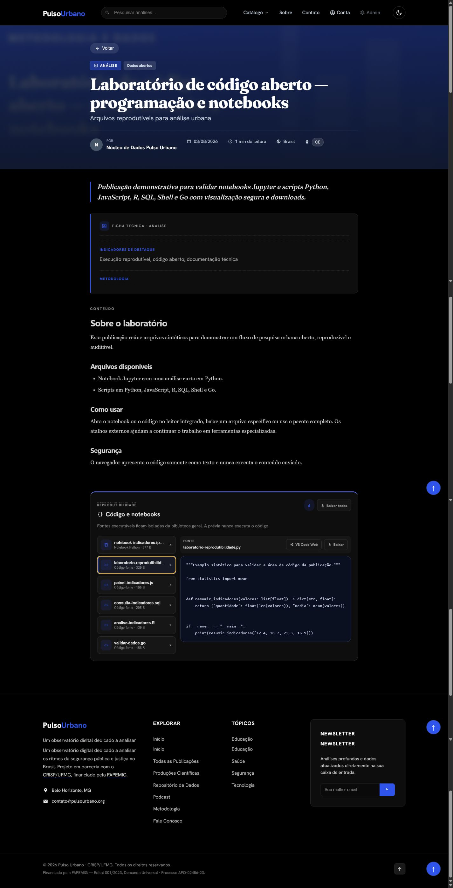

# Homologação do cadastro e das páginas de postagem

Data da validação: 03/08/2026

Ambiente visual: frontend e backend locais conectados ao armazenamento privado e ao banco configurado no projeto.

## Resultado

O fluxo novo foi exercitado como administrador pelo navegador: criação de rascunho, preenchimento editorial, upload direto para o R2, confirmação de integridade, publicação e leitura pública. A postagem `#145` foi publicada como **Laboratório de código aberto — programação e notebooks**.

Arquivos enviados e confirmados nessa postagem:

| Arquivo | Área | Tamanho |
| --- | --- | ---: |
| `notebook-indicadores.ipynb` | Notebook Python | 677 B |
| `laboratorio-reprodutibilidade.py` | Código-fonte | 329 B |
| `painel-indicadores.js` | Código-fonte | 195 B |
| `consulta-indicadores.sql` | Código-fonte | 205 B |
| `analise-indicadores.R` | Código-fonte | 139 B |
| `validar-dados.go` | Código-fonte | 156 B |

O notebook abriu no leitor Jupyter interno. O `.py` abriu como texto com destaque visual e sem execução. Também ficaram disponíveis os atalhos de NBViewer, Colab e VS Code Web, download individual e download do conjunto.

## Postagens verificadas

| ID | Tipo | Página | Evidência |
| ---: | --- | --- | --- |
| 139 | Análise | `/postagem/atlas-da-seguranca-urbana-analise-de-teste` | [captura](./screenshots/01-analise.png) |
| 140 | Produção científica | `/postagem/governanca-urbana-e-prevencao-producao-cientifica-de-teste` | [captura](./screenshots/02-producao-cientifica.png) |
| 141 | Dados | `/postagem/indicadores-municipais-abertos-conjunto-de-dados-de-teste` | [captura](./screenshots/03-dados-e-recursos.png) |
| 142 | Podcast | `/postagem/cidade-em-escuta-podcast-de-teste` | [captura](./screenshots/04-podcast.png) |
| 143 | Livro | `/postagem/cidades-que-cuidam-livro-de-teste` | [captura](./screenshots/05-livro.png) |
| 144 | Vídeo | `/postagem/territorios-em-movimento-video-de-teste` | [captura](./screenshots/06-video.png) |
| 145 | Análise / reprodutibilidade | `/postagem/laboratorio-de-codigo-aberto-programacao-e-notebooks` | [notebook](./screenshots/07-codigo-e-notebooks.png) · [Python](./screenshots/08-leitor-python.png) |

As oito imagens foram coletadas em página completa no breakpoint desktop. Como o cabeçalho é fixo, a captura foi feita em segmentos sobrepostos e montada sem redimensionamento, evitando a repetição que o modo automático do navegador produzia.

## Correções incluídas

- A navegação entre rotas volta ao topo. Nas sete páginas, a posição inicial observada foi `scrollY = 0`.
- Notebooks e arquivos de programação possuem área própria, seletor de arquivos, leitor seguro, atalhos externos e downloads individual/em lote.
- Planilhas, CSV, JSON, SQLite e bancos compatíveis possuem área de dados com prévia dentro da página.
- PDF, Word, texto e Markdown possuem leitor interno, abertura externa e downloads individual/em lote.
- Os seletores de upload ganharam associação explícita entre cada cartão e seu `input`, melhorando acessibilidade e impedindo que o arquivo caia na categoria errada.
- O campo **Indicadores**, digitado como texto livre, agora é convertido para JSON válido antes de ser gravado na coluna `JSONB`.
- Uploads suportam até 2 GB por arquivo e são enviados diretamente ao bucket; o backend confirma tamanho, MIME e existência antes de liberar o anexo.
- Código e notebooks são servidos como `text/plain` para visualização; HTML, JavaScript executável e SVG perigoso continuam fora da biblioteca genérica.
- URLs públicas do bucket foram substituídas por chaves privadas e leituras assinadas com validade curta.
- TLS do PostgreSQL usa verificação completa, e o rate limiter mantém um fallback em memória quando o serviço distribuído está indisponível.
- A migração `backend/scripts/migrations/2026_attachment_workspaces.sql` adiciona as categorias `codigo` e `notebook` ao banco.

## Validação automatizada

- Frontend: ESLint aprovado.
- Frontend: 9 testes aprovados em 2 arquivos.
- Frontend: build de produção aprovado. Permanece apenas o aviso conhecido de tamanho do chunk do Monaco Editor.
- Backend: 40 testes aprovados, 0 falhas e 16 ignorados porque o PostgreSQL de teste não estava disponível.
- `npm audit`: 0 vulnerabilidades no frontend e 0 no backend.
- `git diff --check`: sem erros de whitespace; apenas avisos locais de normalização LF/CRLF.

Os testes de integração ignorados dependem de `TEST_DATABASE_URL`. O fluxo equivalente de criação, gravação JSONB, upload, confirmação, publicação e leitura foi exercitado no navegador contra os serviços configurados.

## Ordem recomendada para deploy

1. Aplicar `backend/scripts/migrations/2026_attachment_workspaces.sql` no PostgreSQL.
2. Instalar as dependências do backend e do frontend com `npm ci`.
3. Publicar o backend antes do frontend, pois a interface nova depende das rotas de confirmação e mídia assinada.
4. Conferir `STORAGE_ENDPOINT`, `STORAGE_BUCKET_NAME`, credenciais R2 e origens permitidas.
5. Dentro de `backend`, executar `node scripts/configure_r2_cors.js --apply` para gravar e verificar a política CORS do bucket.
6. Publicar o frontend apontando `VITE_API_URL` para o backend que contém este commit.
7. Repetir um upload pequeno e uma leitura de cada área após o deploy.

## Evidências visuais

### Análise

### Produção científica

### Dados e recursos

### Podcast

### Livro

### Vídeo

### Notebook

### Código Python

